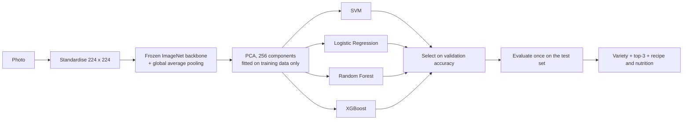

# PithaBD-24 — Recognition of Bangla Traditional Cakes & Desserts Using Deep Learning

An image dataset of **24 traditional Bangladeshi pitha varieties** and a reproducible baseline showing that it supports
fine-grained food recognition. Six frozen ImageNet backbones are combined with four classical classifiers (24
configurations) and evaluated on a **hand-selected test set**.

Course project for **CSE 4112: Machine Learning Laboratory**, Department of CSE, Khulna University of Engineering &
Technology (KUET), Khulna-9203, Bangladesh. Group 05.

| Dataset | Best model (test set) | Test set |
|---|---|---|
| **2,150** unique images · **24** classes | EfficientNet-B0 + Logistic Regression: **82.67 % top-1**, **95.74 % top-3** | **352** images selected by hand |

---

## Why this dataset

Pitha are traditional rice- and milk-based cakes that are central to Bengali food culture, yet they are almost absent from
public food-image resources. Many varieties are made from nearly identical dough and differ only in shape, surface texture
or the liquid they are soaked in, which makes recognising them a genuine **fine-grained** problem. PithaBD-24 covers 24
varieties and ships a metadata file with district, division, cooking method, ingredients, a recipe summary and nutrition
estimates for every class, so a prediction can be turned into a recipe and nutrition lookup.

## The dataset

- **2,197 images collected → 47 exact duplicates removed (MD5) → 2,150 unique images.**
- Sources: YouTube cooking-video frames, Google Images, Facebook (web counts are estimates) and **140 photographs taken by
  the team** with a smartphone (khola jali pitha 65, chitoi 39, malpoya 36).
- 24 classes, 64 to 111 images each (mild imbalance, ratio about 1.7 : 1). Labels are folder names.
- All images are standardised to **224 × 224** (EXIF orientation fixed, aspect ratio preserved, reflection padding, JPEG
  quality 95).
- `pitha_metadata.json` — one record per variety: display name, alternative names, district, division, cooking method, key
  ingredients, recipe summary, calories and macronutrients (estimates, not laboratory values).

| Partition | Original images | Augmented copies | Total files |
|---|---|---|---|
| Training | 1,588 | 7,940 | 9,528 |
| Validation | 210 | — | 210 |
| Test (**selected by hand**) | 352 | — | 352 |

**Leakage control.** The test set is fixed first and byte-identical copies are removed from the training pool. The remaining
pool is split per class (89 % train / 11 % validation, seed 42), and **only then** are training images augmented (5 copies
each: flip, ±15° rotation, colour jitter, crop, noise). Every augmented copy keeps the group of its source image. All six
notebooks produce the same split (fingerprint `93e293cf08d9e44e`).

**Where to get the images:** the dataset folder is linked in Section 14 of the report:
<https://drive.google.com/drive/folders/1QLzSBqg9YN--VgntyrDl5g4mygmyQuaZ?usp=drive_link>

> **Data notice.** Most images are compiled from public web platforms and remain the property of their creators. The
> dataset is intended for non-commercial academic research only. See Section 13 of the report for details.

## Method



- **Backbones (frozen, not fine-tuned):** ConvNeXt-Tiny, DenseNet121, EfficientNet-B0, MobileNetV2, ResNet50, Xception.
- **Classifiers (fixed settings, no tuning):** SVM (RBF, C = 1, γ = 0.01), Logistic Regression (L2, C = 1, lbfgs),
  Random Forest (500 trees), XGBoost (500 trees, GPU).
- **Model selection** uses validation accuracy only; the test set is used once.
- **Metrics:** top-1 and top-3 accuracy, macro F1, ROC-AUC, per-class F1 and the confusion matrix.

## Results

Test accuracy (%) on the 352 hand-selected test images. **Bold** = best classifier for that backbone.

| Backbone | Logistic Regression | SVM (RBF) | Random Forest | XGBoost |
|---|---|---|---|---|
| **EfficientNet-B0** | **82.67** | 80.40 | 75.85 | 71.59 |
| DenseNet121 | **80.11** | 70.17 | 73.30 | 71.02 |
| MobileNetV2 | **79.26** | 67.61 | 71.59 | 69.03 |
| Xception | 78.41 | **79.26** | 71.59 | 66.76 |
| ConvNeXt-Tiny | **77.56** | 22.16 | 67.90 | 67.90 |
| ResNet50 | **76.14** | 11.65 | 71.02 | 70.45 |

Best configuration (EfficientNet-B0 + Logistic Regression): top-1 **82.67 %**, top-3 **95.74 %**, macro F1 **0.820**,
macro ROC-AUC **0.989**, 61 errors out of 352 images.

Things worth knowing:

- **Logistic Regression is best on 5 of 6 backbones.** On Xception the SVM is ahead by three images.
- **The SVM collapses on ConvNeXt-Tiny and ResNet50** because its kernel width was fixed at γ = 0.01 and the features were
  not standardised. This is a settings effect, not a data problem.
- **Validation accuracy is 6 to 13 points higher than test accuracy.** Validation images come from the same pool as the
  training images (often frames of the same video); the hand-selected test set is harder and more realistic.
- **Errors come from look-alike varieties** and are the same for every backbone: muittha → mera, patishapta → binni chaler,
  dudh chitoi → chitoi.
- **Domain shift:** khola jali pitha is trained mostly on team smartphone photos (57 of 60) but tested on web images only,
  and scores only F1 0.47–0.80.

## Repository contents

| Path | Description |
|---|---|
| `pitha_preprocessing.py` | Image loading, orientation, quality check and standardisation |
| `split_and_augment.py` | MD5 de-duplication, stratified split with a fixed test set, augmentation, split manifest |
| `pitha_<backbone>_pipeline.ipynb` | One Colab notebook per backbone (feature extraction → PCA → 4 classifiers → evaluation) |
| `pitha_metadata.json` | Culinary and nutrition metadata for the 24 varieties |
| `CSE_4112_Dataset_Report_PithaBD24.docx` | The full dataset report (Data in Brief format) |

Trained models, extracted features, figures and result tables are produced by the notebooks (`model_<backbone>_results/`
zip) and are not stored in this repository.

## Run it on Google Colab

The notebooks run on **Google Colab** with the data on **Google Drive**. They need no local setup.

| Backbone | Colab notebook | File |
|---|---|---|
| ConvNeXt-Tiny | [](https://colab.research.google.com/drive/1nSOZoUrYKcyWJNvVwxCKo_jIIFDSrpt3?usp=sharing) | `pitha_convnext_pipeline.ipynb` |
| DenseNet121 | [](https://colab.research.google.com/drive/1ow4ZFAiFIYTZC6ku_mxVM8Pb2w51flsb?usp=sharing) | `pitha_densenet_pipeline.ipynb` |
| EfficientNet-B0 | [](https://colab.research.google.com/drive/10tPChwahrVngiZelpaM906jxa1IaIKhX?usp=sharing) | `pitha_efficientnet_pipeline.ipynb` |
| MobileNetV2 | [](https://colab.research.google.com/drive/1jZiqv5m7SvISvWe1riwV1ir6QjTElD3H?usp=sharing) | `pitha_mobilenet_pipeline.ipynb` |
| ResNet50 | [](https://colab.research.google.com/drive/1VmtEdkgPsQCUi5U15Q9X7_i3dtbfSNfZ?usp=sharing) | `pitha_resnet_pipeline.ipynb` |
| Xception | [](https://colab.research.google.com/drive/171xTHjZv6e75jQNfh6cyo00Cx_QNT29V?usp=sharing) | `pitha_xception_pipeline.ipynb` |

**Steps**

1. Put the two data folders on your Google Drive, with one sub-folder per class and identical class names in both:

   ```
   MyDrive/
   ├── clean_data/<class_name>/*.jpg           training + validation pool
   └── split_data_v2/test/<class_name>/*.jpg   test set, selected by hand
   ```

   If they sit inside another folder, the notebook searches Drive for them (or set `DRIVE_DATA_ROOT` in Section 0).
2. Open a notebook and select a GPU runtime: *Runtime → Change runtime type → T4 GPU*. Feature extraction and XGBoost use
   the GPU; a CPU also works, only more slowly.
3. *Runtime → Run all* and approve Google Drive access when asked.
4. At the end, all figures, tables, models and features are zipped as `model_<backbone>_results.zip`, downloaded to your
   computer and copied to `pitha_outputs/` on Drive.

The notebooks write `pitha_preprocessing.py`, `split_and_augment.py` and `pitha_metadata.json` to the Colab disk
themselves, so nothing else has to be uploaded. The ResNet notebook additionally saves the train / validation split it used to
`split_data_v2/train/` and `split_data_v2/val/` on Drive.

## Reproducibility

- One random seed (**42**) is used for the split, augmentation, PCA and every classifier.
- The split is stored in `split_manifest.json` and summarised by a fingerprint; identical fingerprints in all six runs confirm
  identical partitions.
- Environment used for the reported results: Google Colab (Tesla T4), Python 3.13.15, TensorFlow 2.20.0, scikit-learn 1.6.1,
  XGBoost 3.4.1, NumPy 2.1.3, pandas 2.2.3.
- Rerunning a notebook with the same data reproduces the reported numbers.

## Limitations

- Modest size (2,150 images) and about 94 % web-sourced images; the team's smartphone photos cover only three varieties.
- Near-duplicates (consecutive video frames, re-encoded copies) can survive checksum de-duplication.
- Labels were assigned by a small student team and inter-annotator agreement was not measured.
- Nutrition values are estimates and must not be used for clinical advice.
- Backbones are frozen and hyperparameters are fixed; no fine-tuning was attempted.

## Team

| Roll | Name |
|---|---|
| 2107034 | Shahriar Aziz Khan |
| 2107035 | Md. Abdullah Sheikh |
| 2107041 | Md. Zunaied Nudar |
| 2107053 | Abdullah Saeid Bin Omar |
| 2107058 | Mustafizur Rahman (corresponding student) |
| 1807051 | Mamunar Rahman |

## Citation

If you use this dataset or code, please cite the report:

```
Group 05, "Recognition of Bangla Traditional Cakes & Desserts Using Deep Learning: PithaBD-24 dataset report",
CSE 4112 Machine Learning Laboratory, Khulna University of Engineering & Technology, 2026.
https://github.com/zunaiednudar/bengali-pitha-classification
```

## License

Released under the **MIT License**. Images collected from web platforms remain the property of their respective creators and
are provided for non-commercial academic research only.
